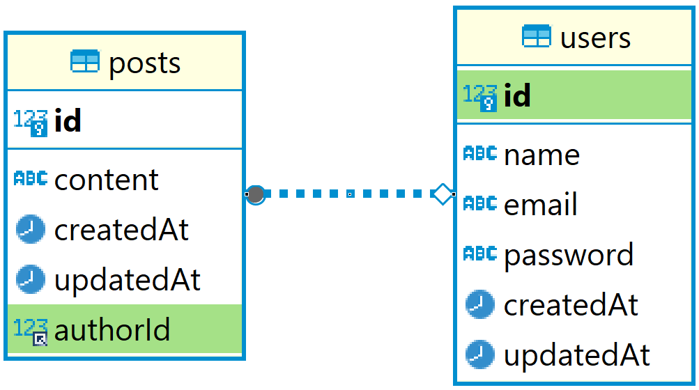

# Application Overview

This application is a simple REST API built with Node.js and NestJS to manage blog posts. It includes user authentication using JSON Web Tokens (JWT). Users and Posts are the main entities in this application.

## Technologies Used

- **Node.js**
- **NestJS** (as the server-side framework)
- **Sequelize** (as the ORM for MySQL)
- **MySQL** (as the relational database)
- **Passport** (for JWT authentication management)

### Setup

#### Prerequisites

- Node.js and npm installed
- MySQL installed and running
- Git installed (for cloning repository)

#### Clone and Install

- Clone the repository:
  ```bash
  git clone https://github.com/hackim18/blog-posts.git
  cd blog-posts
  ```
- Install dependencies:
  ```bash
  npm install
  ```

#### Set up MySQL database

- Create a MySQL database for the project.
- Update the database configuration in src/config/database.config.ts.

#### Start the application

- Start the application:
  ```bash
  npm run start:dev
  ```

## Schema



### User Schema

- **id** (Primary Key, Auto Increment): Unique identifier for the user.
- **name**: The user's name.
- **email** (Unique): The user's email address.
- **password**: The user's password (hashed for security).
- **createdAt**: Timestamp when the user account was created.
- **updatedAt**: Timestamp when the user account was last updated.

### Post Schema

- **id** (Primary Key, Auto Increment): Unique identifier for the post.
- **content**: The content of the post.
- **createdAt**: Timestamp when the post was created.
- **updatedAt**: Timestamp when the post was last updated.
- **authorId** (Foreign Key): The ID of the user who created the post.

## Endpoints

### 1. Register User Endpoint

- **Method:** POST
- **URL:** `/auth/register`
- **Description:** Registers a new user with name, email, and password.
- **Request Body:**
  ```json
  {
    "name": "John Doe",
    "email": "johndoe@example.com",
    "password": "password"
  }
  ```
- **Success Response:** Status 201 Created
  ```json
  {
    "id": 1,
    "name": "John Doe",
    "email": "johndoe@example.com",
    "createdAt": "2024-06-28T12:00:00.000Z",
    "updatedAt": "2024-06-28T12:00:00.000Z"
  }
  ```
- **Error Response:** Status 400 Bad Request
  ```json
  {
    "message": "Please provide name, email and password"
  }
  ```
- **Error Response:** Status 409 Conflict
  ```json
  {
    "message": "User already exists"
  }
  ```

### 2. Login Endpoint

- **Method:** POST
- **URL:** `/auth/login`
- **Description:** Authenticates a user based on email and password to retrieve a JWT token.
- **Request Body:**
  ```json
  {
    "email": "johndoe@example.com",
    "password": "password"
  }
  ```
- **Success Response:** Status 200 OK
  ```json
  {
    "accessToken": "eyJhbGciOiJIUzI1NiIsInR5cCI6IkpXVCJ9..."
  }
  ```
- **Error Response:** Status 401 Unauthorized
  ```json
  {
    "message": "Unauthorized",
    "statusCode": 401
  }
  ```

### 3. Get All Posts Endpoint

- **Method:** GET
- **URL:** `/posts`
- **Description:** Retrieves all posts available in the system.
- **Success Response:** Status 200 OK
  ```json
  [
    {
      "id": 1,
      "content": "Sample post content",
      "createdAt": "2024-06-28T12:00:00.000Z",
      "updatedAt": "2024-06-28T12:00:00.000Z",
      "authorId": 1
    }
  ]
  ```
- **Error Response:** Status 404 Not Found
  ```json
  {
    "error": "Post not found"
  }
  ```

### 4. Get Post by ID Endpoint

- **Method:** GET
- **URL:** `/posts/:id`
- **Description:** Retrieves a single post based on the specified ID.
- **Path Parameter:** id (Post ID)
- **Success Response:** Status 200 OK
  ```json
  {
    "id": 1,
    "content": "Sample post content",
    "createdAt": "2024-06-28T12:00:00.000Z",
    "updatedAt": "2024-06-28T12:00:00.000Z",
    "authorId": 1
  }
  ```
- **Error Response:** Status 404 Not Found
  ```json
  {
    "error": "Post not found"
  }
  ```

### 5. Create Post Endpoint

- **Method:** POST
- **URL:** `/posts`
- **Description:** Creates a new post by an authenticated user.
- **Request Body:**
  ```json
  {
    "content": "New post content"
  }
  ```
- **Authorization Header:** Bearer Token JWT
- **Success Response:** Status 201 Created
  ```json
  {
    "id": 2,
    "content": "New post content",
    "createdAt": "2024-06-28T12:00:00.000Z",
    "updatedAt": "2024-06-28T12:00:00.000Z",
    "authorId": 1
  }
  ```
- **Error Response:** Status 401 Unauthorized
  ```json
  {
    "statusCode": 401,
    "message": "Unauthorized",
    "error": "Unauthorized access"
  }
  ```
- **Error Response:** Status 400 Bad Request
  ```json
  {
    "error": "Content is required"
  }
  ```

### 6. Update Post Endpoint

- **Method:** PUT
- **URL:** `/posts/:id`
- **Description:** Updates an existing post by an authenticated user who is the author of the post.
- **Path Parameter:** id (Post ID)
- **Request Body:**
  ```json
  {
    "content": "Updated post content"
  }
  ```
- **Authorization Header:** Bearer Token JWT
- **Success Response:** Status 200 OK
  ```json
  {
    "id": 1,
    "content": "Updated post content",
    "createdAt": "2024-06-28T12:00:00.000Z",
    "updatedAt": "2024-06-28T12:00:00.000Z",
    "authorId": 1
  }
  ```
- **Error Response:** Status 401 Unauthorized or 403 Forbidden
  ```json
  {
    "statusCode": 403,
    "message": "Forbidden",
    "error": "You are not authorized to update this post"
  }
  ```
  **Error Response:** Status 404 Not Found
  ```json
  {
    "error": "Post not found"
  }
  ```
  **Error Response:** Status 400 Bad Request
  ```json
  {
    "error": "Content is required"
  }
  ```

### 7. Delete Post Endpoint

- **Method:** DELETE
- **URL:** `/posts/:id`
- **Description:** Deletes an existing post by an authenticated user who is the author of the post.
- **Path Parameter:** id (Post ID)
- **Authorization Header:** Bearer Token JWT
- **Success Response:** Status 200 OK
  ```json
  {
    "message": "Post successfully deleted"
  }
  ```
- **Error Response:** Status 401 Unauthorized or 403 Forbidden
  ```json
  {
    "statusCode": 403,
    "message": "Forbidden",
    "error": "You are not authorized to delete this post"
  }
  ```
  **Error Response:** Status 404 Not Found
  ```json
  {
    "error": "Post not found"
  }
  ```

## Testing Using Postman

To test the API, you can use Postman to make requests to each endpoint with various test cases, such as:

- Registering a User
- Logging In
- Fetching All Posts
- Fetching Post by ID
- Creating a New Post
- Updating a Post
- Deleting a Post

## License

This project is licensed under the MIT License.
